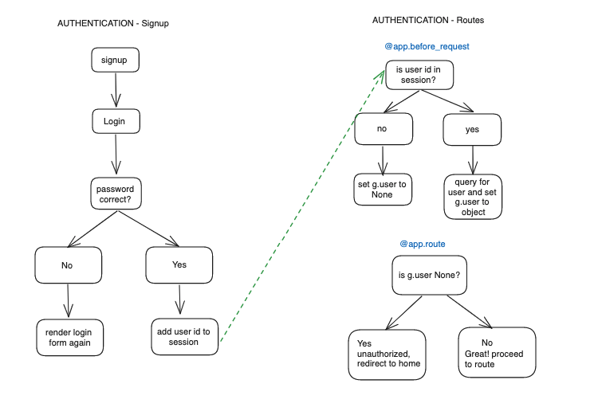
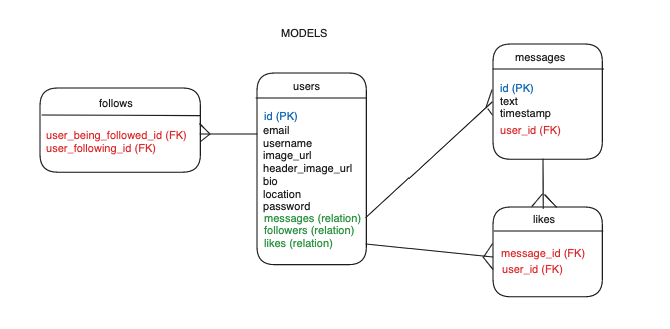

# Warbler
Warbler is a Twitter clone built with Flask, Jinja templates, sqlAlchemy, and Postgresql. Authenticated users have the ability to create new posts and share them with their followers. Additionally, users can engage with posts by liking or unliking them, and they can also follow or unfollow other users.

Deployed app can be found [here](https://claudia-warbler.onrender.com).

# Table of Contents
1. [What I Learned](#What-I-Learned)
1. [Features](#Features)
2. [Tech Stack](#Tech-stack)
3. [Database Entity Relationships](#Database-entity-relationships)
4. [Install](#Install)
5. [Testing](#Testing)
6. [Deployment](#Deployment)
7. [Future Features](#Future-features)

## What I Learned:
* Querying the database with an ORM(sqlAlchemy) vs with SQL
* Working with one to many relationships
* Writing tests for routes that involve logging in and logging out
* Using Flasks's g object with Flasks's session for authentication

## Features:
* Utilizes RESTful API
* Users must create an account to access the application. Passwords are hashed and authenticated using bcrypt.
* Logged in users can edit their profile except for their password, but they still need to input their password to check that the password is valid.
* Logged in users can search for people and follow or unfollow them.
* Logged in users can posts messages.
* Logged in users can can like or unlike messages.

## Tech stack:

### Backend:

### Frontend:

### Database Management:

## Database Entity Relationships:

## Install:
Create Python virtual environment and activate:

    python3 -m venv venv
    source venv/bin/activate

Install dependences from requirements.txt:

    pip install -r requirements.txt

Setup the database:

    createdb warbler
    python seed.py

Create an .env file to hold configurations:

    SECRET_KEY=abc123
    DATABASE_URL=postgresql:///warbler

Start the server:

    flask run

## Testing:
There are four test files: two for testing the models, and two for testing the routes/view-functions:

    FLASK_DEBUG=False python -m unittest <name-of-python-file>

Note: We set FLASK_DEBUG=False for this command, so it doesn’t use debug mode, and therefore won’t use the Debug Toolbar during our tests. If you are having an error running tests (comment out the line in your app.py that uses the Debug Toolbar).

Current test coverage is 89%. Coverage report can be found at /htmlcov or you can run the command:

        coverage run -m unittest discover

## Deployment:
In ElephantSQL, create a 'Tiny Turtle' instance and copy the URL of your new instance.

Seed your database:

    pg_dump -O warbler | psql (url you copied here)

In Render, create a new instance of “Web service”.

Connect to your repository and give your instance a name, which must be globally unique.

Choose advanced, and enter environmental variables:

    DATABASE_URL: URL from ElephantSQL

    SECRET_KEY: anything you want

    PYTHON_VERSION: latest version

Lastly select 'Create Web Service'

## Future features:
* Custom 404 Page
* Optimize queries
* Add change password form
* Add admin users with additional privileges
* Add direct messaging
